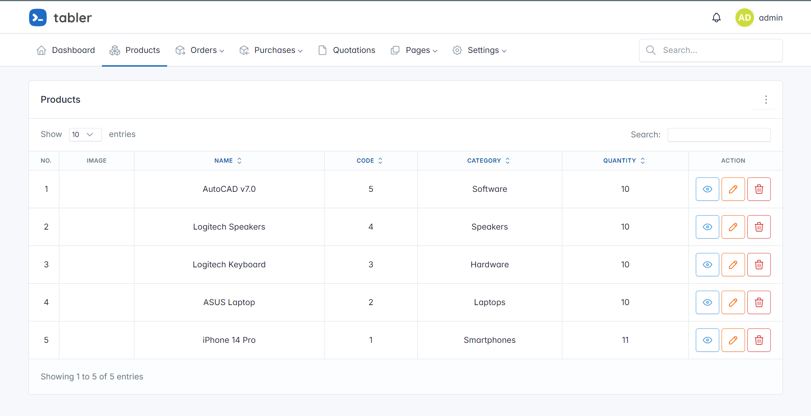

## ✨ Inventory Management System

Inventory Management System with Laravel 10 and MySql.

## 🚀 Features
- POS
- Orders
  - Pending Orders
  - Complete Orders
  - Pending Due
- Purchases
  - All Purchases
  - Approval Purchases
  - Purchase Report
- Products
- Customers
- Suppliers

## :hammer: Setup & How to Use

1. Clone Repository `git clone https://github.com/fajarghifar/inventory-management-system` 
2. Go into the repository `cd inventory-management-system`
3. Install Packages `composer install`
4. Copy `.env` file `cp .env.example .env`
5. Generate app key `php artisan key:generate`
6. Setting up your database credentials in your `.env` file.
7. Migrate database `php artisan migrate`
8. Seed Database: `php artisan migrate:fresh ---seed`
9. Create Storage Link `php artisan storage:link`
10. Install NPM dependencies `npm install && npm run dev`
11. Run `php artisan serve`
12. Try login with email: `admin@admin.com` and password: `password`

## :gear: Config

1. **Config Chart**

    Open file `./config/cart.php`. You can set a tax, format number, etc.
    > For More details, visit this link [hardevine/shoppingcart](https://packagist.org/packages/hardevine/shoppingcart).

## 📝 Contributing

If you have any ideas to make it more interesting, please send a PR or create an issue for a feature request.

# 🤝 License

### [MIT](LICENSE)
